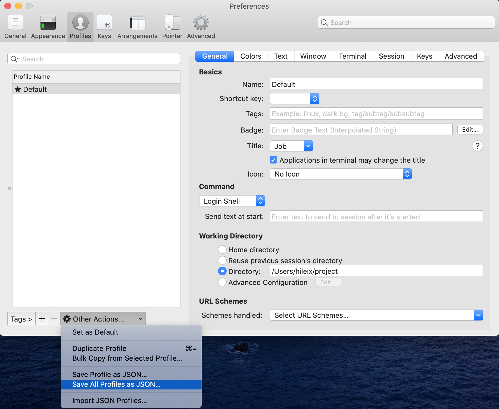

# tool-configuration

vim, tmux, iterm2 configuration.

## vimrc

### 更新本地 .vimrc 配置

```shell
bash scripts/set-vimrc.sh
```

### 更新仓库 .vimrc

```shell
bash scripts/update-vimrc.sh && git add . && git commit -m update && git push origin master
```

## tmux

### 更新本地 .tmux.conf 配置

```shell
bash scripts/set-tmux.sh
```

### 更新仓库 .tmux.conf

```shell
bash scripts/set-tmux.sh && git add . && git commit -m update && git push origin master
```

## iterm2

### 更新本地 iterm2 配置

```shell
bash scripts/set-iterm2.sh
```

### 更新仓库 iter2.config.json

- `cmd + ,` 打开设置 -> Profiles -> Other Actions -> Save All Profiles as JSON
- 将导出的 json 内容复制到 iterm2.config.json 文件中
- 执行 `git add . && git commit -m update && git push origin master`
  
